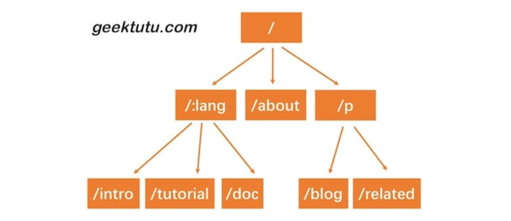

### Trie 树简介

当然可以，Trie 树（也叫字典树、前缀树）是一种 **树形结构**，主要用于**字符串的高效检索**，尤其适用于 **前缀匹配** 场景，比如：

- 搜索引擎的关键词提示
- 自动补全
- 拼写纠错
- 字符串集合去重/查找

---

### 🌲Trie 树的基本结构

Trie 树的每个节点通常表示一个**字符**，路径上的字符拼接起来，能组成一个单词。

```text
插入单词："to", "tea", "ted", "ten", "i", "in", "inn"

         root
        /    \
       t      i
      /       \
     o         n
      \       / \
       (end) n   (end)
     / | \
    e  e  e
   a  d  n
  (end) (end) (end)
```

- 每条路径代表一个单词或单词的前缀。
- 通常在节点上加一个 `isEnd` 标志，表示是否是一个完整单词的结尾。

---

### ✅Trie 树的常见操作

#### 1. 插入（Insert）

```go
func Insert(word string) {
    node := root
    for _, c := range word {
        if node.children[c] == nil {
            node.children[c] = new(TrieNode)
        }
        node = node.children[c]
    }
    node.isEnd = true
}
```

#### 2. 查找完整单词（Search）

```go
func Search(word string) bool {
    node := root
    for _, c := range word {
        if node.children[c] == nil {
            return false
        }
        node = node.children[c]
    }
    return node.isEnd
}
```

#### 3. 查找前缀（StartsWith）

```go
func StartsWith(prefix string) bool {
    node := root
    for _, c := range prefix {
        if node.children[c] == nil {
            return false
        }
        node = node.children[c]
    }
    return true
}
```

---

### 📦Trie 树的优缺点

#### ✅ 优点：
- 查询效率高，**O(m)**，其中 m 是单词长度
- 支持高效的**前缀匹配**
- 可节省空间（多个单词共享前缀）

#### ❌ 缺点：
- 空间占用大，尤其在字符集（如 ASCII）很大时
- 构造过程比哈希表稍复杂

---

### 📚实际应用场景举例

- 搜索引擎的关键词提示（输入 "te"，提示 "tea", "ted", "ten"...）
- 单词自动纠错（Levenshtein + Trie）
- 多模式字符串匹配（如 Aho-Corasick 算法）

---

### 🌐动态路由的实现

HTTP请求的路径恰好是由/分隔的多段构成的，因此，每一段可以作为前缀树的一个节点。我们通过树结构查询，如果中间某一层的节点都不满足条件，那么就说明没有匹配到的路由，查询结束。

接下来我们实现的动态路由具备以下两个功能。

参数匹配:。例如 /p/:lang/doc，可以匹配 /p/c/doc 和 /p/go/doc。
通配*。例如 /static/*filepath，可以匹配/static/fav.ico，也可以匹配/static/js/jQuery.js，这种模式常用于静态服务器，能够递归地匹配子路径。
