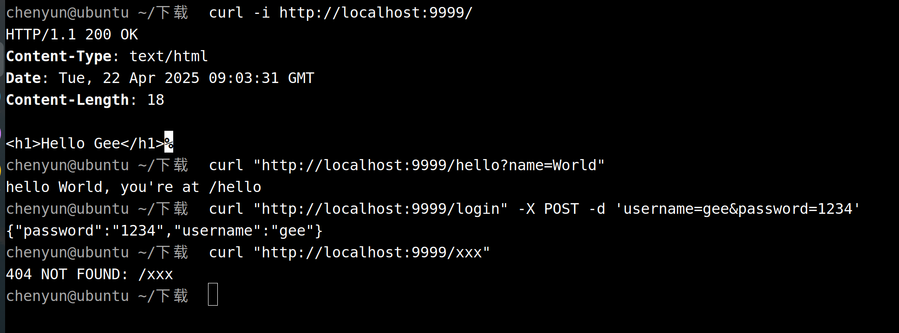

## 测试

`curl -i http://localhost:9999/`

`curl "http://localhost:9999/hello?name=World"`

`curl "http://localhost:9999/login" -X POST -d 'username=gee&password=1234'`

`curl "http://localhost:9999/xxx"`
### 测试结果
